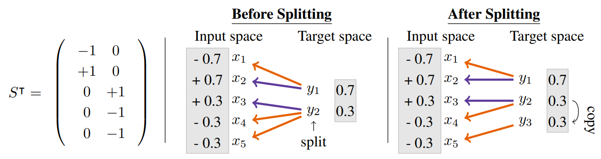

# Increasing the Scope as You Learn: BAxUS



This is the code for [our paper](https://openreview.net/pdf?id=e4Wf6112DI):
`Increasing the Scope as You Learn: Adaptive Bayesian Optimization in Nested Subspaces` (Leonard Papenmeier, Luigi Nardi, and Matthias
Poloczek)

Please see the full [online documentation](https://baxus.papenmeier.io).

## Installation

You have four options for installing `BAxUS`: `PyPi`, `Docker`, `setup.py`, or `requirements.txt`.
Please make sure to install the following packages before running the non-Docker `BAxUS` installation.
We assume that you have a Debian Buster or Bullseye based Linux distribution (e.g., Ubuntu 18.04 or Ubuntu 20.04).
Please use a Docker image if you are working with a different distribution:

### Installation from PyPi

```bash
pip install baxus
```

### Installation from source

First install required software:

```bash
apt-get update && apt-get -y upgrade && apt-get -y install libsuitesparse-dev libatlas-base-dev swig libopenblas-dev libsdl2-mixer-2.0-0 libsdl2-image-2.0-0 libsdl2-2.0-0 libsdl2-ttf-2.0-0 libsdl2-dev
```

Then install with the `setup.py`:

```bash
cd baxus
pip install .
```

or with the requirements.txt:

```bash
cd baxus
pip install -r requirements.txt
```

### Docker image

Alternatively, use the Docker installation.
We do not share the Docker image to ensure anonymity.
However, you can build the Docker image yourself with the provided `Dockerfile`:

First, [install Docker](https://docs.docker.com/engine/install/).
Next, build the Docker image

```bash
cd baxus
sudo docker build -t baxus
```

By default, BAxUS stores all results in a directory called `results`.
To get the results on the host machine, first create this directory and mount it into the Docker container:

```bash
mkdir results
sudo docker run -v "$(pwd)/results":/app/results baxus /bin/bash -c "python benchmark_runner.py -id 100 -td 1 -f branin2 --adjust-initial-target-dimension"
```

After the run completed, the results can be obtained in the `./results` directory.

## Getting started

The main file is `benchmark_runner.py` in the project root.
It can be configured with command line arguments (see [Command Line Options](README.html))

For example, to run `BAxUS` for 1,000 function evaluations on a Branin2 function with input dimensionality 100 for one
repetition run (for installation from source)

```python
python3
benchmark_runner.py - id
100 - td
1 - n
10 - r
1 - m
1000 - f
branin2 - a
baxus - -adjust - initial - target - dimension
```

or, for PyPi installations,

```bash
benchmark_runner.py -id 100 -td 1 -n 10 -r 1 -m 1000 -f branin2 -a baxus --adjust-initial-target-dimension
```

For Docker, follow the instructions above.

Note that we need to pass an initial target dimensionality with `-td 1` even though this is adjusted later by passing
the option `--adjust-initial-target-dimension`-

## Command line options

| **Name**                             | **Shortcut** | **Full argument**                   | **Default**                                                                                                                                                                                                                                                             | **Description**                                                                                                                                                                                                                                                                                                                                                    |
|--------------------------------------|--------------|-------------------------------------|-------------------------------------------------------------------------------------------------------------------------------------------------------------------------------------------------------------------------------------------------------------------------|--------------------------------------------------------------------------------------------------------------------------------------------------------------------------------------------------------------------------------------------------------------------------------------------------------------------------------------------------------------------|
| Algorithm                            | `-a`         | `--algorithms`                      | `baxus`                                                                                                                                                                                                                                                                 | The algorithm to run. Has tobe from `baxus`, `embedded_turbo_target_dim`, `embedded_turbo_effective_dim`, `embedded_turbo_2_effective_dim`, `random_search`                                                                                                                                                                                                        |
| Function                             | `-f`         | `--functions`                       | None                                                                                                                                                                                                                                                                    | One ore several test functions. Has to be from `lunarlander`,`mnist`,`robotpushing`,`roverplanning`,`hartmann6`,`branin2`,`rosenbrock5`,`rosenbrock10`,`ackley`,`rosenbrock`,`levy`,`dixonprice`,`griewank`,`michalewicz`,`rastrigin`,`bipedalnncontroller`,`acrobotnncontroller`,`svm`,`lasso10`,`mopta08`,`hartmann6in1000_rotated`,`rosenbrock5in1000_rotated`. |
| Input dimensionality                 | `-id`        | `--input-dim`                       | `100`                                                                                                                                                                                                                                                                   | Input dimensionality of the function. This is overriden when the function has a fixed dimensionality.                                                                                                                                                                                                                                                              |
| Target dimensionality                | `-td`        | `--target-dim`                      | `10`                                                                                                                                                                                                                                                                    | (Initial) targetdimensionality of the function. Whether initial or not depends on the algorithm. Initial for `BAxUS` as it adapts the target dimensionality.                                                                                                                                                                                                       | |
| Acquisition function                 | None         | `--acquisition-function`            | `ts`                                                                                                                                                                                                                                                                    | Either `ts` (Thompson sampling) or `ei` (Expected improvement)                                                                                                                                                                                                                                                                                                     |
| Embedding type                       | None         | `--embedding-type`                  | `baxus`                                                                                                                                                                                                                                                                 | Either `baxus` (for the BAxUS embedding) or `hesbo` (for the HeSBO embedding)                                                                                                                                                                                                                                                                                      |
| Adjust initial target dimensionality | None         | `--adjust-initial-target-dimension` | not set                                                                                                                                                                                                                                                                 | Whether to adjust initial target dimensionality as described in the BAxUS paper.                                                                                                                                                                                                                                                                                   |
| Number of initial samples            | `-n`         | `--n-init`                          | None (set to target dimensionality + 1 if not set)                                                                                                                                                                                                                      | Number of samples.                                                                                                                                                                                                                                                                                                                                                 |
| Number of repetitions                | `-r`         | `--num-repetitions`                 | `1`                                                                                                                                                                                                                                                                     | Number repetitions of the run.                                                                                                                                                                                                                                                                                                                                     |
| Number of evaluations                | `-m`         | `--max-evals`                       | `300`                                                                                                                                                                                                                                                                   | Number evaluations. Cma-ES might use a few more.                                                                                                                                                                                                                                                                                                                   |
| Initial baselength                   | `-l`         | `--initial-baselength`              | `0.8`                                                                                                                                                                                                                                                                   | The base length of the trust region (default value is as in the TuRBO paper).                                                                                                                                                                                                                                                                                      |
| Minimum baselength                   | `-lmin`      | `--min-baselength`                  | `0.5^7`                                                                                                                                                                                                                                                                 | The base length a trust region is allowed to obtain (default value is as in the TuRBO paper).                                                                                                                                                                                                                                                                      |
| Maximum baselength                   | `-l_max`     | `--max-baselength`                  | 1.6                                                                                                                                                                                                                                                                     | The maximum base length a trust region is allowed obtain (default value is as in the TuRBO paper).                                                                                                                                                                                                                                                                 |
| Noise standard deviation             | None         | `--noise-std`                       | `0`                                                                                                                                                                                                                                                                     | The deviation of the noise. Whether this is used or not depends on the benchmark. It is generally only recognized synthetic benchmarks like `Branin2` but also for the synthetic `Lasso` versions.                                                                                                                                                                 |
| Results directory                    | None         | `--results-dir`                     | `results`                                                                                                                                                                                                                                                               | The directory which the results are written. Relative to the path from which the run was started.                                                                                                                                                                                                                                                                  |
| Run description                      | None         | `--run-description`                 | None                                                                                                                                                                                                                                                                    | Short description that will be added to the run directory                                                                                                                                                                                                                                                                                                          |
| MLE multistart samples               | None         | `--multistart-samples`              | `100`                                                                                                                                                                                                                                                                   | Number of multistart samples for the MLE GD optimization. Samples will be drawn from latin hypercube                                                                                                                                                                                                                                                               |
| Multistarts after sampling           | None         | `--multistart-after-sample`         | `10`                                                                                                                                                                                                                                                                    | Only recognized for `--mle-optimization sample-and-choose-best`. Number of multi-start gradient descent optimization of the `--multistart-samples` best ones.                                                                                                                                                                                                      |                                                                                                                                                                                                                                                                                                                                                                    |
| MLE optimization method              | None         | `--mle-optimization`                | `sample-and-choose-best`                                                                                                                                                                                            Either `multistart-gd` or `sample-and-choose-best`. |                                                                                                                                                                                                                                                                                                                                                                    |
| Number of MLE gradient updates       | None         | `--mle-training-steps`              | `50`                                                                                                                                                                                                                                                                    | Number of GD steps in MLE maximization.                                                                                                                                                                                                                                                                                                                            |                                                                                                                                                                                                                                                                                                                                                                    |
| Budget until input dimensionality    | None         | `--budget-until-input-dim`          | `0`                                                                                                                                                                                                                                                                     | The budget after which BAxUS will roughly reach the input dimensionality (see paper for details). If `0`: this is ignored                                                                                                                                                                                                                                          |              |                                     |                                                                                                                                                                                                                                                                                                                                                                                                                                                                                                                                                                                                                                                                                                                                                                                                                                                                                                                                        |                                                                                                                                                                                                                                                                                                                                                                                                                                                                                                                                                                                                                                                                                                                                                                                                                                                                                                              |
| Verbose mode                         | `-v`         | `--verbose`                         | not set                                                                                                                                                                                                                                                                 | Whether to print verbose messages                                                                                                                                                                                                                                                                                                                                  |

## Optimizing custom functions

### Custom benchmark class

For practical use cases, you want to optimize your own functions instead of running benchmark functions. Let's see how
we implement benchmark functions. As an example,
[MoptaSoftConstraints](source/baxus.benchmarks.html#baxus.benchmarks.real_world_benchmarks.MoptaSoftConstraints)
implements
[SyntheticBenchmark](source/baxus.benchmarks.html#baxus.benchmarks.benchmark_function.SyntheticBenchmark), which means
in particular that it has its
own `__call__` function.

Let's look at the `__call__` function
of [MoptaSoftConstraints](source/baxus.benchmarks.html#baxus.benchmarks.real_world_benchmarks.MoptaSoftConstraints):

```python
def __call__(self, x):
    super(MoptaSoftConstraints, self).__call__(x)
    x = np.array(x)
    if x.ndim == 0:
        x = np.expand_dims(x, 0)
    if x.ndim == 1:
        x = np.expand_dims(x, 0)
    assert x.ndim == 2

    vals = np.array([self._call(y) for y in x]).squeeze()
    return vals
```

which consists of some checks that ensure that we use the internal `self._call` function correctly.

If you want to use BAxUS with a custom function, you can just use this implementation and replace
`self._call` in the line
`vals = np.array([self._call(y) for y in x]).squeeze()`
with a call to your own function expecting a 1D numpy array.

### Example for a custom benchmark function

A custom benchmark function could look as follows:

```python3
from typing import Union, List

import numpy as np
from baxus.benchmarks.benchmark_function import Benchmark


class Parabula(Benchmark):

    def __init__(self):
        super().__init__(dim=100, ub=10 * np.ones(100), lb=-10 * np.ones(100), noise_std=0)

    def __call__(self, x: Union[np.ndarray, List[float], List[List[float]]]):
        x = np.array(x)
        if x.ndim == 0:
            x = np.expand_dims(x, 0)
        if x.ndim == 1:
            x = np.expand_dims(x, 0)
        assert x.ndim == 2
        y = np.sum(x ** 2, axis=1)
        return y
```

To run `BAxUS` on it, either register it for the benchmark runner (see explanation below),
or call `BAxUS` directly:

```python3
from baxus import BAxUS

baxus = BAxUS(
    run_dir="results",
    max_evals=100,
    n_init=10,
    f=Parabula(),
    target_dim=2,
    verbose=True,
)

baxus.optimize()

```

The results of the optimization can afterwards be obtained by

```python3
x_raw, y_raw = baxus.optimization_results_raw()  # get the points in the search space and their function values
x_inc, y_inc = baxus.optimization_results_incumbent()  # get the points in the search space and the best function value at each time step
```

### How do I register my new function?

For this we need to look at the [parsing.parse](source/baxus.util.html#baxus.util.parsing.parse) function.
The first thing to do is to append your benchmark to the list of existing benchmarks,
currently consisting of

```python
required_named.add_argument(
    "-f",
    "--functions",
    nargs="+",
    choices=[
        "hartmann6",
        "branin2",
        ...,
        "MY_NEW_NAME"  # <---------------- ADD THIS LINE 
    ],
    required=True,
)
```

Next, we have to register the new name in the [parsing.fun_mapper](source/baxus.util.html#baxus.util.parsing.fun_mapper)
function:

```python
def fun_mapper():
    return {
               **{
                   "hartmann6": Hartmann6,
                   "branin2": Branin2,
                   "rosenbrock2": functools.partial(RosenbrockEffectiveDim, effective_dim=2),
                   ...,
               "MY_NEW_NAME": MyBenchmarkImplementation  # <--------- ADD THIS LINE
           },
    ** _fun_mapper,
    }
```

and that's it. 

## Citation 

Please cite [our paper](https://openreview.net/pdf?id=e4Wf6112DI) if you use the code:

```
@inproceedings{
papenmeier2022increasing,
title={Increasing the Scope as You Learn: Adaptive Bayesian Optimization in Nested Subspaces},
author={Leonard Papenmeier and Luigi Nardi and Matthias Poloczek},
booktitle={Advances in Neural Information Processing Systems},
editor={Alice H. Oh and Alekh Agarwal and Danielle Belgrave and Kyunghyun Cho},
year={2022},
url={https://openreview.net/forum?id=e4Wf6112DI}
}
```
